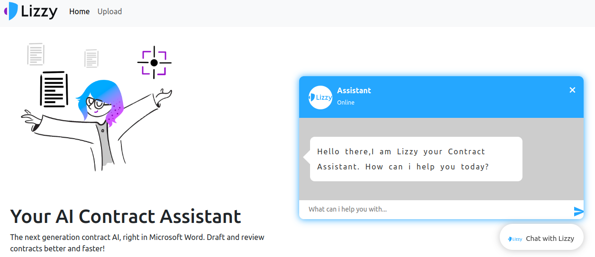

# Week2 Data Engineering Data warehouse
## project Overview

The goal is to develop an advanced contract AI system for Lizzy AI, creating the first fully autonomous artificial contract lawyer. Using Hybrid LLM technology, the project focuses on building, evaluating, and enhancing a RAG (Retrieval Augmented Generation) system for Contract Q&A. This involves marrying powerful language models with external data sources to provide accurate and context-rich responses. The project includes researching RAG system improvements, building a Q&A pipeline, establishing a RAG evaluation pipeline,optimizing Contract Q&A, and implementing enhancements. Ultimately, it aims to revolutionize the legal industry with an autonomous contract assistant capable of independent contract drafting, review, and negotiation.


## Articles
- [Medium Article](https://medium.com/@abrhamaddis32/unraveling-the-potential-of-retrieval-augmented-generation-rag-in-building-and-enhancing-legal-d9c2b5f23969)

## Table of Contents
- [Project Structure](#project-structure)
    * [client](#clinet)
    * [images](images/)
    * [data](#data)
    * [notebooks](#notebooks)
    * [scripts](#scripts)
    * [server](#server)
  - [Installation guide](#installation-guide)
  - [Tech Stack](#tech-stack)
  - [Getting Started](#Getting-started)
    * [Prerequests](*prerequests)
    * [Installations](*installations)
  - [Tech Stack](#tech-stack)

### images:

- `images/` the folder where all snapshot for the project are stored.

### clinet:

- `clinet/` the folder contain all the front end part of the project .

### data:

 - `*.csv` the folder where the dataset versioned csv files are stored.

### .github:

- `.github/`: the folder where github actions and CML workflow is integrated.


### server:
- `models`: the folder contain all the back end part of the project.

### notebooks:

- `prepare.ipynb`: a jupyter notebook for exploring the data.

## Tech Stack 
Tech Stack used in this project
* [React](https://react.dev/learn)
* [Flask](https://flask.palletsprojects.com/en/3.0.x/)
* [Langchin](https://python.langchain.com/docs/use_cases/question_answering/)
* [chromaDB](https://www.trychroma.com/)
* [RAGs](https://docs.ragas.io/en/stable/)
## Getting Started
Seting up the front-end
```
git clone https://github.com/abrhamadddis/Contract-Advisor-RAG.git
cd client
npm install
npm start

```
Seting up the front-end
```
git clone https://github.com/abrhamadddis/Contract-Advisor-RAG.git
cd server
python run server.py 
```
## Contact

Abrham Addis - [@email](abrhamaddis32@gmail.com)
Contact Me  - [@contact](https://www.linkedin.com/in/abrham-addis-302748160/)
